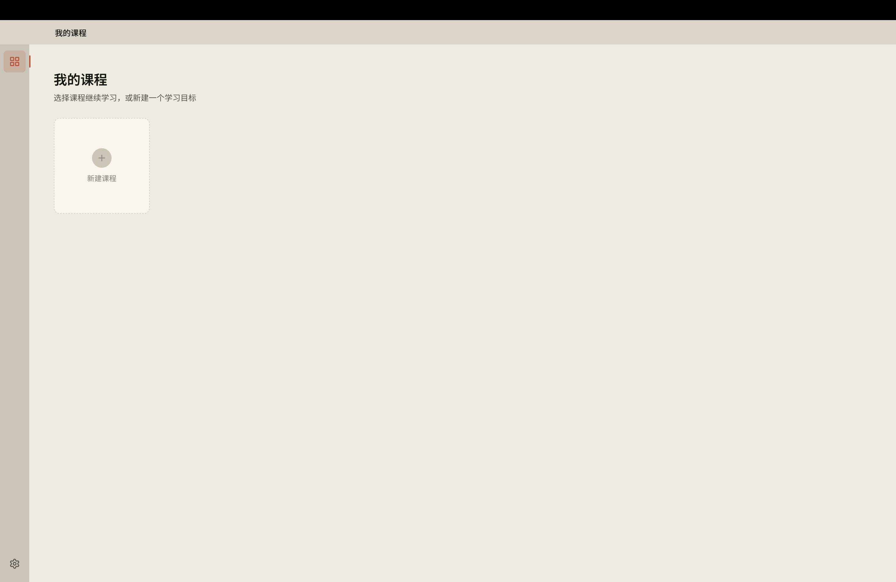

# Ulyzer

[中文](README.md) | [English](README.en.md)

**An AI-powered personal knowledge graph learning tool.** Ulyzer turns any learning goal into a DAG-based roadmap, then helps you learn node by node with AI tutors, generated materials, practice, and review.

> 🚧 In development · macOS first · Stars and feedback are welcome



---

## Core Features

- **Learning roadmap (DAG)** — Generate a visual dependency graph from your goals, background, and time budget.
- **Knowledge component outlines** — Each node can evolve from v1 to v3 outlines, from beginner-friendly coverage to deeper survey-level structure.
- **AI tutor conversations** — A main tutor plans and adjusts the roadmap; a node tutor creates explanations, exercises, and reference answers.
- **Feynman review** — Generate review checklists to test whether you truly understand a node.
- **Local-file-first workspace** — Generated materials are stored as editable local Markdown files, with Mermaid diagram rendering.
- **RAG retrieval** — Retrieve existing node materials to reduce repeated generation.
- **Multi-model support** — Switch between cloud providers, OpenAI-compatible endpoints, and local Ollama models.

---

## Supported AI Providers

Anthropic · OpenAI · DeepSeek · Google Gemini · xAI Grok · Alibaba Qwen · MiniMax · OpenRouter · Ollama (local) · Any OpenAI-compatible endpoint

---

## Run Locally

### Requirements

- Node.js 18+
- macOS recommended. Windows and Linux may work but are not fully tested yet.

### Install and Start

```bash
git clone https://github.com/seethith/Ulyzer.git
cd Ulyzer
npm install
npm run dev
```

### Build

```bash
# macOS
npm run build:mac

# Windows
npm run build:win

# Linux
npm run build:linux
```

---

## Releasing (maintainers)

The app ships a **semi-automatic updater**: on startup (and via Settings → "Check for updates") it reads the latest version from this repo's GitHub Releases, compares it to the running version, and — if a newer one exists — shows a top banner asking whether to download. Clicking opens the Release page in the system browser (no auto-download/install, so no code signing is required).

To cut a release:

1. **Bump the version** in `package.json` (e.g. `0.1.0-alpha → 0.2.0`, following [semver](https://semver.org)).
2. **Build** with `npm run build:mac` / `build:win` / `build:linux` (artifacts land in `release/`).
3. **Create a GitHub Release** tagged `v0.2.0` (keep the `v` prefix), attach the `.dmg`/`.exe` installers, write release notes, and mark alpha/beta builds as **pre-release**.
   - Shortcut: with a `GH_TOKEN` env var set, run `npx electron-builder --publish always` to create the Release and upload artifacts automatically (`publish: github` is already configured in `electron-builder.yml`).

> The updater receives pre-releases by default (the app is in alpha); users can turn this off under Settings → About.

---

## Configure API Keys

After launching Ulyzer, open **Settings → Model** and add the API key for the provider you want to use.

Keys are stored in the operating system keychain and are not intended to be written into files or logs.

If you want a local-only setup, configure [Ollama](https://ollama.com) and use a local model.

---

## Documentation

- [Privacy](docs/PRIVACY.en.md)
- [Contributing](CONTRIBUTING.md)
- [Security](SECURITY.md)

---

## Data Storage

Application data is stored locally by default:

- **Database**: `~/Library/Application Support/Ulyzer/ulyzer.db` (SQLite)
- **Learning files**: `~/Library/Application Support/Ulyzer/ulyzer-content/` (Markdown files)

When you use cloud model providers or web search, relevant prompts, attachment snippets, and search queries are sent to the third-party services you configure. To reduce third-party data transfer, use Ollama or another local provider and leave Tavily / Exa / YouTube search keys unconfigured.

---

## Tech Stack

Built on the shoulders of these excellent open-source projects:

- **Desktop**: Electron · electron-vite
- **Frontend**: React · TypeScript · Tailwind CSS · Zustand · React Router
- **Editor / canvas**: CodeMirror · Monaco Editor · React Flow
- **Content rendering**: marked · highlight.js · KaTeX · Mermaid · DOMPurify
- **Document extraction**: Mozilla Readability · mammoth · pdf-parse
- **Data / storage**: better-sqlite3 (SQLite FTS5 full-text search) · keytar
- **Models / i18n**: Anthropic SDK · OpenAI SDK · tiktoken · i18next

The UI font is [Noto Sans SC](https://fonts.google.com/noto/specimen/Noto+Sans+SC), icons are from [Lucide](https://lucide.dev). PDF/image OCR is built in; optional features like video subtitles and local speech-to-text can be installed in one click under Settings → Advanced (see [External Tools](docs/EXTERNAL-TOOLS.md)).

---

## Maintenance & Support

Ulyzer is a personal, best-effort open-source project — no guaranteed response time:

- **Bug reports**: welcome via [Issues](https://github.com/seethith/Ulyzer/issues); include OS, version, and steps to reproduce.
- **Feature requests**: discussion welcome, but no promise of implementation or timeline.
- **Pull requests**: welcome — please open an issue to discuss direction first; merge is at the maintainer's discretion.
- **Security issues**: please do **not** open a public issue; report privately per [SECURITY.md](SECURITY.md).

---

## License

[MIT](LICENSE) © 2025 seethith
